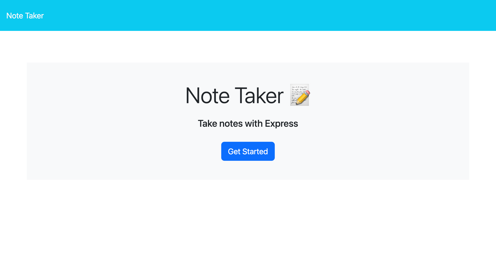
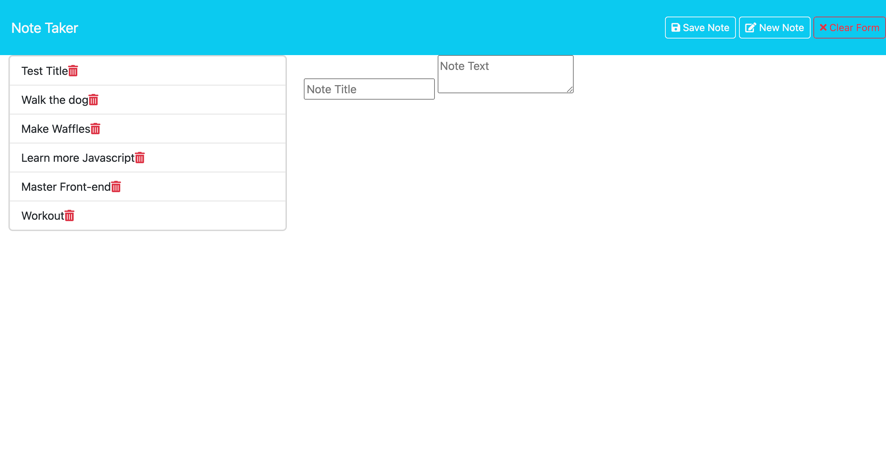

# Express.Js Note Taker
## Description
This application uses express.js back end and will save and retrieve note data from a JSON file. I built this project to learn more about how to work with express js and backend technologies.
## User Story
``` 
As a small business owner
I want to be able to write and save notes
so that I can organize my thoughts, and keep track of tasks I need to complete.
```
## Usage
When the user enters the website they are directed to a page with a "Get Started" button. After clicking get started, the user is then directed to the note taking page where they can enter, save, and delete notes.



## Deployment Link 
 The application is deployed in Render.
  Click [Here](https://note-taker-bzzi.onrender.com) to visit Note Taker.


